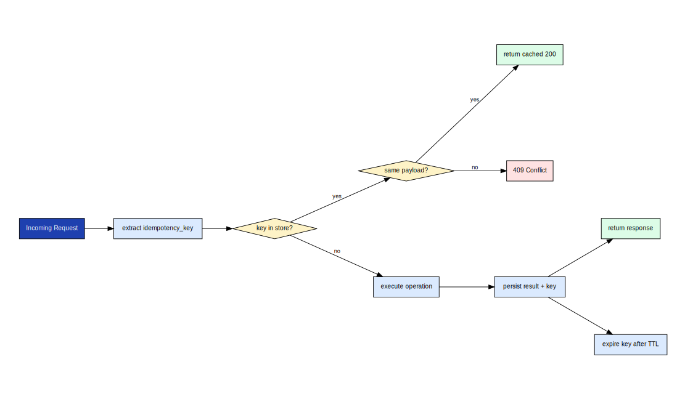

# axme-sdk-python

**Official Python SDK for the AXME platform.** Send and manage intents, observe lifecycle events, work with inbox and approvals, and access the full enterprise admin surface — all from idiomatic Python.

> **Alpha** · API surface is stabilizing. Not recommended for production workloads yet.  
> Bug reports, feedback, and alpha access → [hello@axme.ai](mailto:hello@axme.ai)

---

## What You Can Do With This SDK

The AXME Python SDK gives you a fully typed client for the AXME platform. You can:

- **Send intents** — create typed, durable actions that the platform guarantees to deliver
- **Observe lifecycle** — stream real-time state transitions, waiting events, and delivery confirmations
- **Approve or reject** — handle human-in-the-loop steps directly from Python code
- **Control workflows** — pause, resume, cancel, update retry policies and reminders mid-flight
- **Administer** — manage organizations, workspaces, service accounts, and access grants

---

## Install

```bash
pip install axme-sdk
```

For local development from source:

```bash
python -m pip install -e ".[dev]"
```

---

## Quickstart

```python
from axme_sdk import AxmeClient, AxmeClientConfig

client = AxmeClient(
    AxmeClientConfig(
        base_url="https://gateway.axme.ai",
        api_key="YOUR_API_KEY",
    )
)

# Check connectivity
print(client.health())

# Send an intent
intent = client.create_intent(
    {
        "intent_type": "order.fulfillment.v1",
        "payload": {"order_id": "ord_123", "priority": "high"},
        "owner_agent": "agent://fulfillment-service",
    },
    idempotency_key="fulfill-ord-123-001",
)
print(intent["intent_id"], intent["status"])

# Wait for resolution
resolved = client.wait_for(intent["intent_id"], terminal_states={"RESOLVED", "CANCELLED"})
print(resolved["status"])
```

---

## API Method Families

The SDK covers the full public API surface organized into families. The map below shows all method groups and how they relate to the platform's intent lifecycle.


*Each family corresponds to a segment of the lifecycle or an operational domain. Intents and inbox are D1 (core). Approvals, schemas, and media are D2. Enterprise admin and service accounts are D3.*

---

## Create and Control Sequence

From calling `create_intent()` to receiving a delivery confirmation — the full interaction sequence with the platform:


*The SDK sets the `Idempotency-Key` and `X-Correlation-Id` headers automatically. The gateway validates, persists, and returns the intent in `PENDING` state. The scheduler picks it up and drives delivery.*

---

## Idempotency and Replay Protection

Every mutating call in the SDK accepts an optional `idempotency_key`. Use it for all operations you might retry.



*Duplicate requests with the same key return the original response without re-executing. Keys expire after 24 hours. The SDK will warn if you reuse a key with different parameters.*

```python
# Safe to call multiple times — only executes once
intent = client.create_intent(payload, idempotency_key="my-unique-key-001")
```

---

## Observing Intent Events

The SDK provides a streaming event observer that delivers real-time lifecycle events over SSE:

```python
for event in client.observe(intent["intent_id"]):
    print(event["event_type"], event["status"])
    if event["status"] in {"RESOLVED", "CANCELLED", "EXPIRED"}:
        break
```

---

## Approvals and Human-in-the-Loop

```python
# Fetch pending approvals for an agent
pending = client.list_inbox({"owner_agent": "agent://manager", "status": "PENDING"})

for item in pending["items"]:
    # Approve with a note
    client.resolve_approval(item["intent_id"], {"decision": "approved", "note": "LGTM"})
```

---

## Workflow Controls

Update retry policy, reminders, or TTL on a live intent without cancelling it:

```python
client.update_intent_controls(
    intent_id,
    {
        "controls": {
            "max_retries": 5,
            "retry_delay_seconds": 30,
            "reminders": [{"offset_seconds": 3600, "note": "1h reminder"}],
        }
    },
    policy_generation=intent["policy_generation"],
)
```

---

## SDK Diagrams

The SDK docs folder contains diagrams for the API patterns used by this client:

| Diagram | Description |
|---|---|
| [`01-api-method-family-map`](docs/diagrams/01-api-method-family-map.svg) | Full API family overview |
| [`02-create-and-control-sequence`](docs/diagrams/02-create-and-control-sequence.svg) | Intent creation and control flow |
| [`03-idempotency-and-replay-protection`](docs/diagrams/03-idempotency-and-replay-protection.svg) | Idempotency protocol |

---

## Tests

```bash
pytest
```

---

## Repository Structure

```
axme-sdk-python/
├── axme_sdk/
│   ├── client.py              # AxmeClient — all API methods
│   ├── config.py              # AxmeClientConfig
│   └── exceptions.py          # AxmeAPIError and subclasses
├── tests/                     # Unit and integration tests
└── docs/
    └── diagrams/              # Diagram copies for README embedding
```

---

## Related Repositories

| Repository | Role |
|---|---|
| [axme-docs](https://github.com/AxmeAI/axme-docs) | Full API reference and integration guides |
| [axme-spec](https://github.com/AxmeAI/axme-spec) | Schema contracts this SDK implements |
| [axme-conformance](https://github.com/AxmeAI/axme-conformance) | Conformance suite that validates this SDK |
| [axme-examples](https://github.com/AxmeAI/axme-examples) | Runnable examples using this SDK |
| [axme-sdk-typescript](https://github.com/AxmeAI/axme-sdk-typescript) | TypeScript equivalent |
| [axme-sdk-go](https://github.com/AxmeAI/axme-sdk-go) | Go equivalent |

---

## Contributing & Contact

- Bug reports and feature requests: open an issue in this repository
- Alpha program access and integration questions: [hello@axme.ai](mailto:hello@axme.ai)
- Security disclosures: see [SECURITY.md](SECURITY.md)
- Contribution guidelines: [CONTRIBUTING.md](CONTRIBUTING.md)
